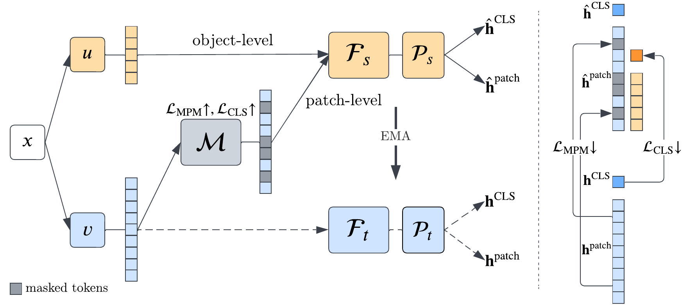
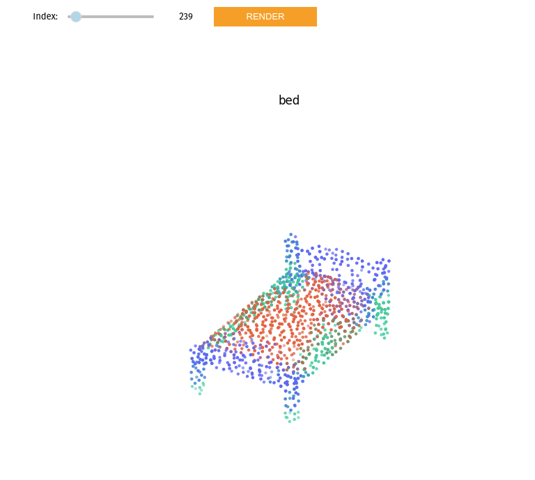
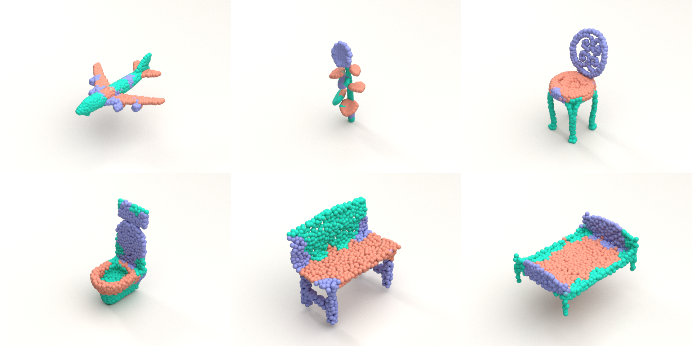

# Self-supervised adversarial masking for 3D point cloud representation learning

Michał Szachniewicz, Wojciech Kozłowski, Michał Stypułkowski, Maciej Zięba

[[paper](https://arxiv.org/abs/2307.05325)]

## PointCAM architecture

PointCAM (**Point** **C**louds with **A**dversarial **M**asking) is an adversarial method for learning a masking function for point clouds. The model utilizes a self-distillation framework with an online tokenizer for 3D point clouds (similar to iBOT). Compared to previous techniques that optimize patch-level and object-level objectives, we postulate applying an auxiliary network that learns how to select masks instead of choosing them randomly. 




## Installation
```bash
pip install -e . && pip install -e .[3d]
```

If you have trouble installing `pytorch3d`, see [INSTALL.md](https://github.com/facebookresearch/pytorch3d/blob/main/INSTALL.md).

## Usage

### Download pretrained model
```
git lfs pull --include="checkpoints/pointcam.pt" --exclude=""
```

### Extracting features
```python
import torch

from pointcam.models import PointCAM
from pointcam.utils.crop import PatchFinder

model = PointCAM.from_exported_checkpoint('path/to/checkpoint.pt').eval().cuda()
patch_finder = PatchFinder(64, 32)

xyz = torch.rand(1, 1024, 3)
xyz = patch_finder(xyz).to("cuda")

with torch.no_grad():
    features = model(xyz) # [1, 768]
```

### Exploring generated masks
To explore generated masks on ModelNet40 dataset, run the notebook `notebooks/visualize_masks.py`. You should see a GUI that allows to iterate over the dataset:



### Rendering masks in Mitsuba

In order to use the `RENDER` button in the GUI, you need to have [Mitsuba service](https://github.com/kacperkan/mitsuba-flask-service) running in the background. Clicking `RENDER` will send a request to the service and save rendered image in the `images` directory.



## Data
Set the `DATA_PATH` environment variable to the directory where you want to store the data. Inside this directory you should have the following structure:
```
$DATA_PATH/
├── ShapeNetFPS
├── ScanObjectNN
├── ModelNet40FPS
└── ModelNet40Fewshot
```

### ShapeNet
Download [ShapeNetCore v2](https://shapenet.org/download/shapenetcore) from the official website and preprocess it with:
```bash
python scripts/prepare_points_fps.py --dir ShapeNet --out-dir ShapeNetFPS --ext obj --n-points 8192 --n-process 16
```
### ScanObjectNN
Download [ScanObjectNN](https://hkust-vgd.github.io/scanobjectnn/) from the official website, extract to `ScanObjectNN`.

### ModelNet40
Download [ModelNet40](https://modelnet.cs.princeton.edu/) from the official website and preprocess it with:
```bash
python scripts/prepare_points_fps.py --dir ModelNet40 --out-dir ModelNet40FPS --ext off --n-points 1024 --n-process 16
```

### ModelNet40 Few-shot
Use splits defined in [PointBERT](https://github.com/lulutang0608/Point-BERT/blob/master/DATASET.md), extract to `ModelNet40Fewshot`.


## Experiments

Experiments configs are located in `pointcam/configs` directory.

### Results

| Experiment | Dataset | Accuracy [%] |
|------------|---------|--------------|
| Linear SVM | ModelNet40 | 91.52 ± 0.26 |
| Finetuning | ModelNet40 | 92.6 ± 0.2 |
| Finetuning | ScanObjNN.OBJ_BG | 90.36 ± 0.25 |
| Finetuning | ScanObjNN.OBJ_ONLY | 88.35 ± 0.53 |
| Finetuning | ScanObjNN.PB_T50_RS | 84.49 ± 0.38 |

### Pretraining
To pretrain the model on ShapeNet, run:

**Adversarial masking**
```bash
python scripts/train.py -m pointcam
```

**Random masking**
```bash
python scripts/train.py -m pcbot
```

### Downstream tasks

**Linear evaluation with SVM on ModelNet40**
```bash
python scripts/eval_svm.py path/to/checkpoint.pt
```

**Finetuning on ModelNet40 and ScanObjectNN**
```bash
python scripts/eval_mlp.py path/to/checkpoint.pt -c {mn40, scanobjbg, scanobjonly, scanobjhardest}
```

**Few-shot classification on ModelNet40**
```bash
python scripts/eval_fewshot.py path/to/checkpoint.pt --way {5, 10} --shot {10, 20}
```

**Part segmentation on ShapeNetPart**

Based mostly on [PointBERT implementation](https://github.com/lulutang0608/Point-BERT/tree/master/segmentation). Needs to be integrated with the rest of the codebase.

## Citing PointCAM
```bibtex
@misc{szachniewicz2023selfsupervised,
      title={Self-supervised adversarial masking for 3D point cloud representation learning}, 
      author={Michał Szachniewicz and Wojciech Kozłowski and Michał Stypułkowski and Maciej Zięba},
      year={2023},
      eprint={2307.05325},
      archivePrefix={arXiv},
      primaryClass={cs.CV}
}
```